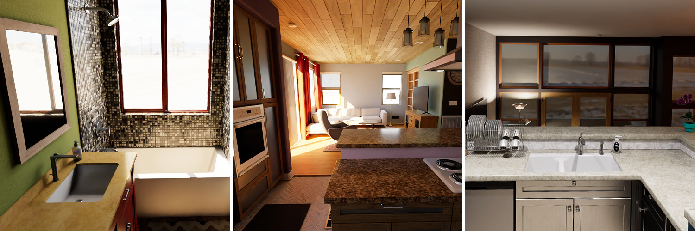

<p align="center">

</p>

# Synthetic Homes

Use cases for in-home computer vision are innumerable, but gathering diverse home interior data in the real world is notoriously difficult due to privacy concerns and restrictions. Synthetic Homes is a Unity based application that generates labeled datasets of synthetic home interiors for the purpose of training computer vision models.

The application performs a wide variety of randomizations to maximize the diversity of generated datasets. These include materials, furniture type and configuration, sunlight angle and temperature, day/night switching, interior lighting temperature, camera angles, clutter, skybox, door and curtain animations, and more. By providing a configuration file, you control customize many of these elements, enabling you to tune them to your liking.

This applications was made using the [Unity Perception package](https://github.com/Unity-Technologies/com.unity.perception), which provides tools for generating randomized synthetic CV datasets with a wide variety of ground-truth annotations.

Interior lighting in homes is complex and is difficult to replicate with traditional raster-based methods. We used Unity’s multi-bounce **path tracing** to accomplish physically accurate global illumination and reflections. This accuracy can help bridge the so called “Sim2Real gap”, improving a model’s ability to perform well in the real world after training on synthetic data.

## System Requirements

* Windows 10 or 11 64-bit 
* DX12 with DXR compatible GPU for path tracing (list available [here](https://docs.unity3d.com/Packages/com.unity.render-pipelines.high-definition@14.0/manual/Ray-Tracing-Getting-Started.html))
  * The application will fall back to rasterization if DXR capable hardware is not detected.

## Included Label Types
* Instance and semantic segmentation
* 2D bounding boxes
* Occlusion percentage of each object
* Depth
* Normals
* Pixel word position
* Camera position and properties

## Command Line Arguments
* `--scenario-config-file=<path-to-json-file>`
  * Supply a configuration file to control various parameters related to rendering and randomization. See below for Instructions.

* `--resolution=<width>x<height>`
  * Set the resolution of the output images. Example usage: `--resolution=1600x1200`
* `--output-path <path>`
  * Specify output folder

## Analyzing and Visualizing Datasets

Datasets are generated in the SOLO formatted. For information on how to explore and analyze SOLO datasets, check out the relevant pages on the Perception repository.

## Configuration File

Several aspects of the dataset generation can be controlled using a JSON config file that is provided to the application. A sample config file is provided [here](https://github.com/Unity-Technologies/SyntheticHomes/blob/main/SampleScenarioConfiguration.json).

The configuration file includes two main sections: (a) **constants** and (b)**randomizers**.

In the **constants** block, you specify:
* `iterationCount`: The number of Iterations the simulation should run for. Each Iteration produces one annotated frame. E.g. to generate 1000 images in your dataset, you should set thus value to 1000.
* `randomSeed`: The seed used for randomization. This generator uses Perception's randomization framework, which generates deterministic random numbers based on a provided seed. This helps you replicate datasets by keeping your seed value and randomization settings unchanged.

In the **randomizers** block of the JSON config file, you control the behavior of Perception Randomizers included in the project. Each Randomizer has one JSON block in this file. `randomizerId` denotes the name of the Randomizer, and `items` are the list of settings that can be changed. To change the behavior for each `item`, what you will need to modify is the `value` blok nested inside. In addition, some Randomizers can be completely disabled. We will now go through all the available Randomizers and their settings:

* **`ScenarioSettings`**: Controls high level settings for the simulation.
  * `includeSingleFamilyVariantA`, `includeSingleFamilyVariantB`, `includeSingleFamilyVariantC`, `includeMultiFamilyVariantA`: The generator includes four house shells. The `bool` value of `true` or `false` for each of these specifies whether they should be used by the generator. The first three listed here are single story houses, while the fourth is a multi-story one.
  * `includeBathrooms`, `includeKitchens`, `includeBedrooms`, `includeDiningRooms`, `includeLivingRooms`, `includeHallsAndStairs`, `includeLaundryRooms`: Set the `bool` value of these to `true` or `false` to specify whether a certain type of room should be included or not.
  * `usePathTracing`: Whether hardware accelerated path tracing should be enabled. Note that this only works with DXR compatible GPUs.
  * `pathTracingSamples`: Sets the number of path traced frames to accumulate for the final image. There is a progress bar at the bottom of the screen view which indicates the current accumulation with respect to this value. Higher values lead to sharper and higher quality images.
  * `pathTracingMaxDepth`: Sets the maximum number of light bounces in each path.
  * `denoiserType`: We use a denoising algorithm to achieve the final image after all the path tracing samples have been accumulated. In our experience, even with very large values for `pathTracingSamples` (above 1000), denoising is still needed for noise free output. By default, we use the Intel Open Image algorithm which seems to yield generally better results. We recommend you experiment with various values for number of samples and denoiser type to achieve your desired outcomes.
    * Acceptable values for the `str` field for `denoiserType`:
      * `intel`: Use the Intel Open Image denoiser
      * `nvda`: Use the NVIDA Optix denoiser
      * `none`: Disable denoising
  * `useAovsForDenoising`: When either `nvda` or `intel` are selected above, this flag specifies whether the texture and normal information on the materials is used to enhance the output of the denoising algorithm. This can substantially improve the look of most surfaces, but can have a negative detail crushing effect on surfaces that are visible behind other transparent objects, such as bathtub walls behind shower doors.
  * `enableTemporalDenoising`: Controls whether temporal information is used in denoising. Only applies to the `nvda` option above.
  * `enableBloom`: Enables a bloom effect on very bright highlights. Note that enabling this can make it look like the camera's view is completely black until the full frame is accumulated.
* **`SceneRandomizer`**: Each of the house shells mentioned earlier is in a separate Unity Scene. This Randomizer handles the switching of Scenes and thus house shells. 
  * `iterationsPerScene`: Set the `num` field of this block to the number of Iterations you would like each house shell to be used in. Your `iterationCount` set in the **constants** block above divided by this value equals the number of house shells your simulation has time to visit before it ends. 
* **`VantagePointsCameraPlacementRandomizer`**: The camera is randomized by selecting one of several available vantage points. 
  * `pitch`: The angle (in degrees) at which the camera is looking up or down from the horizon. Values are uniformly sampled from the given range. Positive values result in the camera looking up and negative values make the camera look down. Change the `min` and `max` values nested inside this block to modify camera pitch. The valid range is [-180, 180].
  * `yaw`: The horizontal angle (in degrees) between the camera's look direction and the line between the camera's position and the center of the room. Values are uniformly sampled from the given range. Positive values result in the camera looking to the right and negative values make it look to the left. Change the `min` and `max` values nested inside this block to modify camera yaw. The valid range is [-180, 180].
  * `roll`: Degrees of rotation around the forward axis of the camera. Non-zero values lead to non-straight horizon lines. Values are uniformly sampled from the given range. Change the `min` and `max` values nested inside this block to modify camera roll. The valid range is [-180, 180].
  * `heightFromFloor`: Height of the camera from the floor, in meters. Sampled uniformly from the `min` to `max` range specified here. The ceiling is typically at about 2.7 meters or higher. When placing the camera near the floor, make sure you provide a range of pitch angles that cause it to look up, otherwise it can look through the floor. Similarly, if your camera is very high, make it look down.
  * `fovRange`: Range of angles to use for the camera's field of view. Sampled uniformly from the `min` to `max` range specified here.
* **`SplitGrammarRandomizer`**: Generates and randomizes the type and arrangement of furniture. Set the `enabled` value to `true` or `false` to enable or disable furniture completely.
* **`SkyBoxRandomizer`**: Randomizes the HDRI skybox. If disabled, a single skybox will be used in all images.
* **`CameraPostProcessingRandomizer`**: Controls a number of post processing effects on the camera.
  * `blurOnProbability`: The probability of lens blur being enabled in a frame. Values are uniformly sampled from the given `min` to `max` range. The valid range is [0, 1].
  * `blurIntensityParameter`: Range of of intensity of the blur effect, when it is randomly turned on based on the probability above. Values are uniformly sampled from the given `min` to `max` range. The valid range is [0, 1].
  * `contrastParameter` and `saturationParameter`: Values are uniformly sampled from the given `min` to `max` range. The valid range is [-100, 100]. Note that numbers close to 100 or -100 can lead to completely unusable images.
* **`DoorOpeningRandomizer`**: Randomizes the degree to which doors are open. If disabled, all doors will be in a fully closed state.
* **`MaterialSwapperRandomizer`**: Randomizes the materials on a large portion of the surfaces. If disabled, no materials will be randomized and walls will have a typical white color.
* **`ClutterSwapperRandomizer`**: Generates and randomizes the occasional clutter on bathroom floors. If disabled, no clutter will be generated.
* **`CustomSunAngleRandomizer`**: Randomizes the direction and temperature of sunlight based on the given parameters.
  * `warmLimit` and `coldLimit`: The warmest (for sundown and sunrise) and coldest (for mid-day) color temperatures to use. 
  * `dayTimeBegin` and `dayTimeEnd`: Specifies what hours of the day (e.g. 8 and 17) correspond to the above `warmLimit` value. The `coldLimit` value will be mapped to the hour exactly in-between these two values (in our example 12:30 pm)
  Valid range for both is [0, 24] and `dayTimeBegin` should be smaller than `dayTimeEnd`.
  * `hourRange1` and `hourRange2`: You have the option of providing two ranges of hours. When randomizing the sun, one of these ranges will be picked, then a random hour in the picked range will be selected, and then the sun's direction and temperature will be set based on the chosen hour. Valid range for both is [0, 24] and both ranges should fall within the range of daylight hours specified above using `dayTimeBegin` and `dayTimeEnd`.
* **`DayNightSwitcherRandomizer`**:  Decides whether day or night time illumination is used in each frame, and can also randomize camera exposure. At daytime, the sunlight and the ambient light coming in from the windows are the only sources of illumination. At night time, the sun is deactivated and interior light fixtures are turned on.
  * `dayProbability`: The probability that day time is selected. A value of 1 for the `num` field here results in all images being day time.
  * `onlySelectDaytimeIfRoomHasWindows`: Some rooms do not have any windows and would thus be completely dark in day time lighting. If this flag is enabled, day time would never be selected when the camera is in those rooms.
  * `randomExposure`: Enable this to introduce some randomization into the overall exposure of the camera, resulting in darker or brighter images.
  * `exposureRange`: The range of exposures to use when the above `randomExposure` flag is enabled. The valid range is [0, 1]. Smaller numbers generate darker images.
* **`LightFixtureController`**: Randomizes the temperature of interior light fixtures, which is uniformly sampled from the provided `min` and `max` values. Each light fixture is randomized individually, resulting in a variety of light temperatures in the house.

  

## License
* [License](LICENSE.md)

## Citation
If you find SynthHomes useful, consider citing it using:
```
@misc{SyntHomes,
    title={Unity SynthHomes: A Synthetic Home Interior Dataset Generator},
    author={{Unity Technologies}},
    howpublished={\url{https://github.com/Unity-Technologies/SynthHomes}},
    year={2022}
}
```


## TODOs

* Add link to pysolotools and Voxel51 tutorials viewer after perception release.
* Links and/or scripts for downloading the dataset